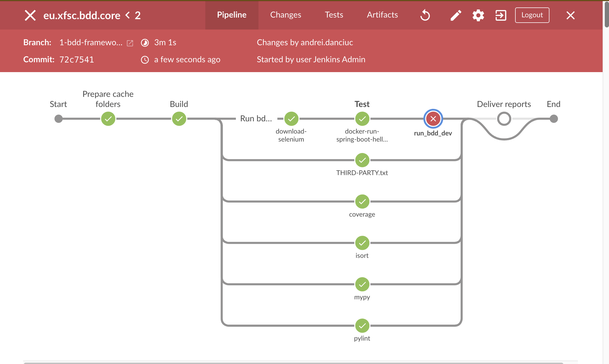

# eu.xfsc.bdd.core Behaviour-driven development (BDD) framework

Based on python's based BDD lib [Behave].

# Description

This is `eu.xfsc.bdd.core` extendable code source helper to implement a BDD test pipeline.

Check it out the [Minimal-project] for "How To".
To start new implementation, duplicate and modify [Minimal-project] or
any other project linked to this repository as git submodule under [Implementations] directory.

CI Automation (Setup, Run and Reports) is set up with Jenkins.
Here's the pipeline visualization from the [Jenkinsfile](Jenkinsfile) [Minimal-project] pipeline:




# Getting started

## Requirements

* Clone with submodules

  ```bash
  git clone --recurse-submodules git@github.com/eclipse-xfsc/bdd-executor.git \
    -b optional-branch-name-if-not-main
  ```

* Docker Engine (Docker Desktop, Podman machine, Rancher ...)
* For macOS or Linux, we provide below instructions on how to set up.
* For Windows, we recommend a dockerized setup or a remote (ssh) Linux dev server.

## Setup

There are two ways to set up the development machine:

- [Native or Bare Metal](deployment/bare_metal/README.md) (recommended)
- [Dockerized](deployment/docker/README.md) (most suitable for Windows machine)

## Use your implementation

See [Minimal-project].
Duplicate, edit, add your features and steps.


## Run

Once the above [Setup](#setup) is done, we can run.

### 1. Setup environments [env.sample.sh](env.sample.sh)

NOTE: Optional for framework and recommended for concrete implementation.

   ``` bash
   # Duplicate sample file
   $ cp env.sample.sh env.sh

   # Configure file
   $ vim env.sh

   # Start your IDE with new environments
   $ bash ./env.sh
   ```

### 2. Start any required services by the

Usually those are dockerized services.

> **_HINT:_** Ensure on macOS to start Docker Engine (Desktop Docker, Podman machine or Rancher)
before running the below command.

We recommend adding a make command per requirement.

### 3. Execute BDD features

```bash   
make run_bdd_dev
```


### 4. (OPTIONAL) Generate Runtime coverage report

See `eu.xfsc.bdd.core` implementation for Java coverage in [TCR-helper].

```bash
make coverage-report
```

Open Coverage on macOS
``` bash
# e.g.
open ./jars/coverage_with_jar/index.html
```

Open Coverage on Linux
``` bash
# e.g.
xdg-open ./jars/coverage_with_jar/index.html
```

## License

Apache License Version 2.0 see [LICENSE](LICENSE).

----------------------------------------------------------------------------------

[Minimal-project]: implementations/minimal-project/README.md
[Implementations]: ./implementations/
[TCR-helper]: https://gitlab.eclipse.org/eclipse/xfsc/train/BDD/-/blob/main/submodule/trusted-content-resolver-helper/Makefile?ref_type=heads#L54
