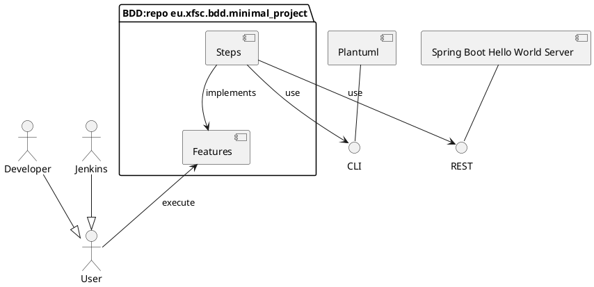

# Minimal Project Example

Based on XFSC python based BDD lib [eu.xfsc.bdd.core]

# Description

CI Automation (Setup, Run and Reports) is set up with [Jenkinsfile](../../Jenkinsfile).



# Getting started

## Requirements

* TODO: Clone with submodules (some-component1, some-component2, ...)

  ```bash
  git clone --recurse-submodules git@<current-repo-url> \
    -b optional-branch-name-if-not-main
  ```

* Docker Engine (Docker Desktop, Podman machine, Rancher ...)
* For macOS or Linux, we provide below instructions on how to set up.
* For Windows, we recommend a dockerized setup or a remote (ssh) Linux dev server.

## Setup

For setup, look into  [eu.xfsc.bdd.core/README.md](../../README.md).

## Run

### 1. Start all required services.

Fetch PlantUML JAR

```bash
$ make download-selenium
```

Start in Spring Boot Hello World Server as Docker container

> **_HINT:_** Ensure on macOS to start Docker Engine (Desktop Docker, Podman machine or Rancher)
before running the below command.

```bash
# Start component and leave it running as a process
$ make docker-run-spring-boot-hello-world
```

### 2. Execute BDD features [features](features)

```bash
export EU_XFSC_BDD_CORE_PATH=<path-if-bdd-core-is-located-not-in ../..>
make run_bdd_dev
```

## License

Apache License Version 2.0 see [LICENSE](LICENSE).

----------------------------------------------------------------------------------

[eu.xfsc.bdd.core]: https://github.com/eclipse-xfsc/bdd-executor


